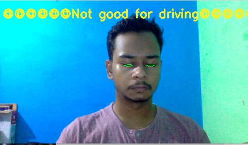

# Road-Safety-NITI-AYOG
It was a project done for niti ayog's road safety problem. This software comprises of various features:
1.Informing and warning the driver about small issues like harsh braking, sharp turns and high acceleration.
2.It won't let the sleepy and the drunk people drive.
3.It detects vehicles and tracks their number if they try to drive over the speed limit.
4. It provides a vision for driving at night.

Here in this image the black dots specify the region where you need to apply brakes
Red dots-Sharp turn 
Blue dots- high acceleration .
now we need to catch those who dont drive good .

driving in dangerous and driving in night makes it more hazardous .
so we need a script that makes the vehicles clear at night even those who don't have lights in them, like cycles don't have any lights in them so its not easy to spot cycle drivers at night . so here's the solution .

it also detects the drowsiness while driving which can be due to tiredness or if the driver is drunk, this is a real time feature which keeps running untill the vehicle is on .

Atlast to check the working of this software we physically noted the locations of the danger spots and then we plotted them on the google maps along with the location spots predicted by the software .

The accuracy is basically measured on the basis of the distance between the original location and the predicted location which came out to be this :

so an error of 3-4 meters is negligible while driving and is even more safe.
